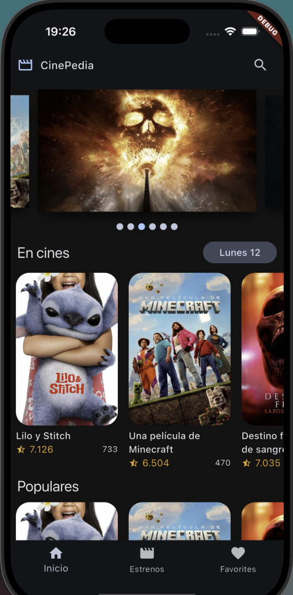
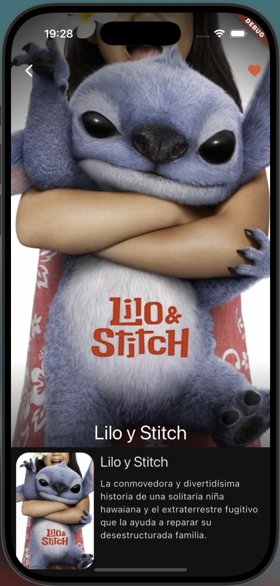
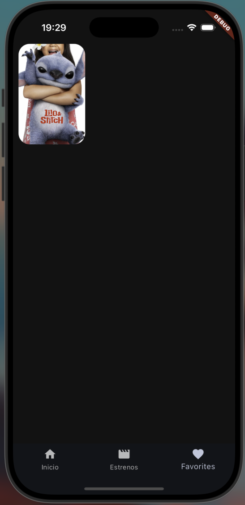

# 🎬 CinePedia

Aplicación móvil de ejemplo construida con **Flutter + Riverpod + go_router + Isar** que muestra estrenos de cine, películas populares y permite gestionar tus favoritas de forma local.

<table>
  <tr>
    <td align="center"></td>
    <td align="center"></td>
    <td align="center"></td>
  </tr>
  <tr>
    <td align="center">Inicio</td>
    <td align="center">Detalle</td>
    <td align="center">Favoritos</td>
  </tr>
</table>

---

## ✨ Características

- **Listado de películas** “En cines”, “Populares” y “Próximos estrenos”.
- **Detalle** con sinopsis, reparto y galería de imágenes.
- **Favoritos offline** persistidos en Isar.
- **Tema oscuro** por defecto.
- Navegación declarativa con **go_router** y animaciones con `PageView`.
- Arquitectura limpia con **Riverpod** & repositorios.

---

## 🚀 Primeros pasos

```bash
git clone 
cd cinemapedia
flutter pub get
```

### Variables de entorno

1. Copia el archivo **`.env.template`** y renómbralo a **`.env`**  
2. Sustituye las claves de `MOVIEDB_BASE_URL` y `MOVIEDB_API_KEY` por las tuyas.

### Generar modelos / proveedores

Cada vez que cambies los modelos ejecuta:

```bash
flutter pub run build_runner build --delete-conflicting-outputs
```

---

## 🛠️ Comandos útiles

| Tarea | Comando |
|-------|---------|
| Ejecutar app en un emulador iOS/Android | `flutter run` |
| Analizar código (lint) | `flutter analyze` |
| Actualizar dependencias | `flutter pub upgrade` |
| Limpiar build & cachés | `flutter clean` |

---